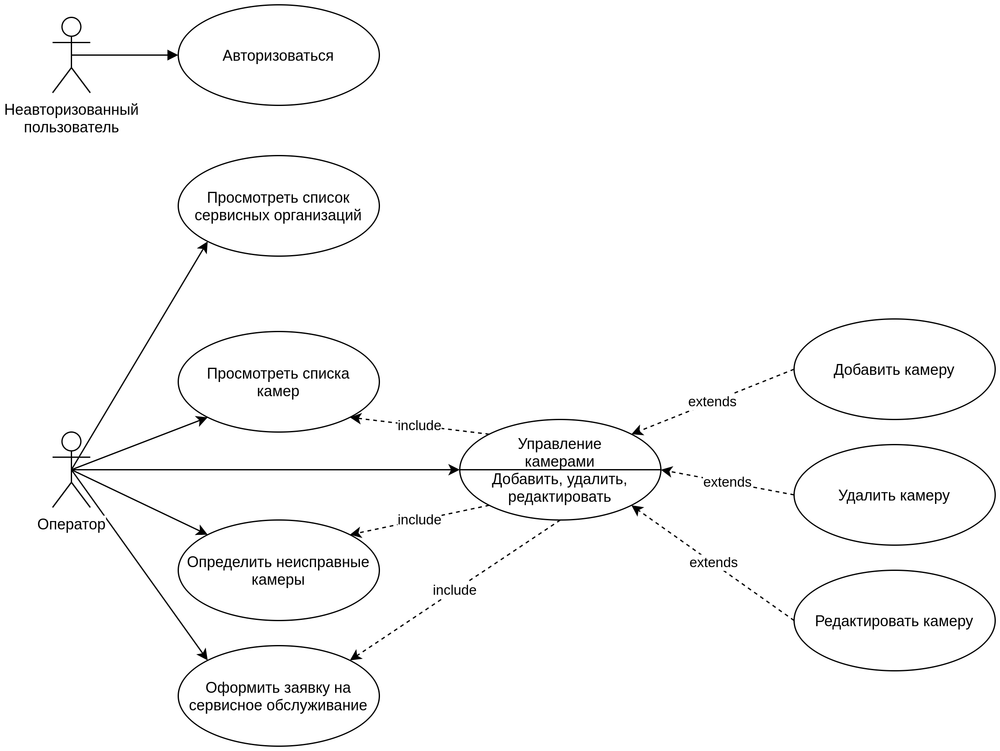

# Лабораторная работа №1
### HTTP, REST, Nginx

1. Взять за основу приложение с базой данных.
2. В md файле кратко описать:
    * цель работы, решаемая проблема;
    * перечень функциональных возможностей;
    * use-case диаграмма системы;
    * ER-диаграмма системы.
3. Спроектировать в формате swagger API системы в идеологии REST.
4. По спроектированному swagger подготовить реализацию в программном коде.
5. Настроить Nginx для работы web-приложения в части маршрутизации.
6. Настроить Nginx в части балансировки.
7. Настроить Nginx таким образом, чтобы подменялось имя сервера в заголовках http-ответов.
8. Настроить кеширование и gzip-сжатие в Nginx.

---

#### Цель работы

Разработать приложение обеспечивающее частичную автоматизацию процессов мониторинга и технического обслуживания камер безопасности дорожного движения.

#### Перечень функциональных возможностей

1. Регистрация и авторизация
2. Просмотр списка камер
3. Добавление, редактирование и удаление камер
4. Просмотр подробной информации о камере
5. Просмотр списка неисправных камер
6. Просмотр списка сервисных организаций
7. Добавление, редактирование и удаление севисных организаций
8. Управление базой данных через административную панель

#### Use-case диаграмма

#### ER диаграмма

